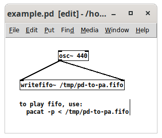

# writefifo~

A Pure Data object to write audio to a named pipe (aka fifo). Useful for sharing data between Pure Data and ALSA, PulseAudio, or [Forked-Daapd](https://github.com/ejurgensen/forked-daapd).

